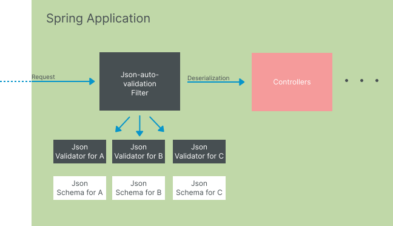

# How does it work

When the API is launched,
json-auto-validation will make a pass over all the Dto to be validated to generate
their associated json schema and a validator bean.

When an incoming request comes in, it is intercepted by the **JsonSchemaValidationInterceptor**,
which retrieves the validators associated with the controller handler,
and sends the request to each validator for validation in turn:

If no DTO is used to deserialize the request, a default validator will be
used to validate each controller handler parameter directly.

## Preventive Measures

Before installing a bookstore, it's always a good idea to understand
what it can do for your project. As far as **Json-auto-validation** here are a few things
you need to know before setting out to install it.

### Request reader
In order to validate the request before it is deserialized,
it is necessary to encapsulate the Body in an HttpServletRequestWrapper
used in a RequestFilter.
Therefore, the body can be read multiple times, at least one time for the validation,
and one time for the deserialization.

### Automatic resource generation

This library is based on automatically generated Beans and schema files:
- dto json schemas (at application launch)
- validation Beans for each of these dto (at application launch)

### Usage of cache
To limit the time it takes to validate a request, certain information can be cached.
When you want to validate basic parameters directly on your endpoints,
**Json-auto-validation** will automatically generate the corresponding schematics.
Since these schemas will not change from one call to the next,
they will be stored in cache.
To avoid excessive cache usage, use DTO classes as much as possible for json validation.
Schematics will be generated automatically when the application is launched.

The cache is used from the spring cache library and has been activated
with the org.springframework.cache.annotation.EnableCaching annotation.